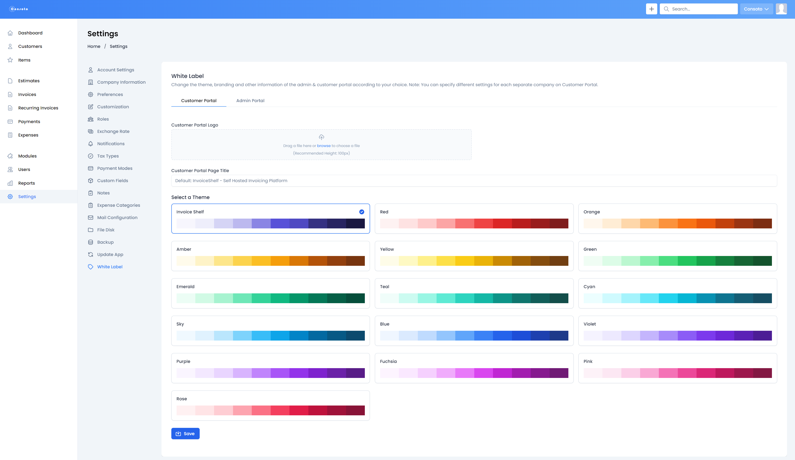

# Invoice Shelf - White Label Module

Adds ability to customise your InvoiceShelf instance with logo and brand color.

## Table of Contents

- [Installation](#installation)
- [Development](#development)
- [Troubleshooting](#troubleshooting)
- [Copyright](#copyright)

## Installation

1. Download the zip with pre-built module from the latest release in this repo. Alternatively you can build from source, for that follow the steps in the [development](#development) section.
2. Create `/Modules/` dir in your server InvoiceShelf project root. **NOTE:** make sure it's capitalised like in example, it's not a typo.
3. Upload the `WhiteLabel.zip` into the newly created `/Modules/` dir.
4. Unzip it.
5. In your server InvoiceShelf project `/` root dir, run `php artisan install:module WhiteLabel 1.0.0`.
6. (optional) If you have any issues with your installed module, try clearing your browser's `cache`, `cookies`, and/or `site data`.

## Development

This is a step by step guide on how to get started, with development.

### Prerequisites

1. nvm/fnm (optional)
2. Node JS: `20 LTS`
3. `yarn`

### Steps

1. Clone the [InvoiceShelf repo](https://github.com/InvoiceShelf/InvoiceShelf) - needed for the admin components. In the future it's likely to be just a node package and you wont need this step.
2. Create `Modules/` dir, in the root dir.
3. Clone this repo into `WhiteLabel/` dir inside `/Modules/`.
4. Initialise `node_modules` by running `yarn` inside `/` of the InvoiceShelf repo.
5. Initialise `node_modules` by running `yarn` inside `/Modules/WhiteLabel/` of this repo.
6. Make the changes you wish to make.
7. Run `yarn build`, new `/Modules/WhiteLabel/dist/` dir will be created with built `css` and `js` bundles.
8. Upload the contents of `/Modules/WhiteLabel/` to your server with InvoiceShelf. Either use SFTP or zip up the folder.
9. Continue from [Installation (Step 2)](#installation)

## Troubleshooting

- If your uploaded logo isn't showing up or uploading you may need to again fix the `/storage/` permissions by running `chmod -R 775 storage`.
- If can't see a save button you need to clear your `cache`, `cookies`, and/or `site data` as specified in [Installation (Step 6)](#installation)

## Copyright

    Copyright (C) 2022-2023 <Nicolas Widart> n.widart@gmail.com
    Copyright (C) 2024 <Rihards Simanovics> rihards.s@griffin-web.studio
